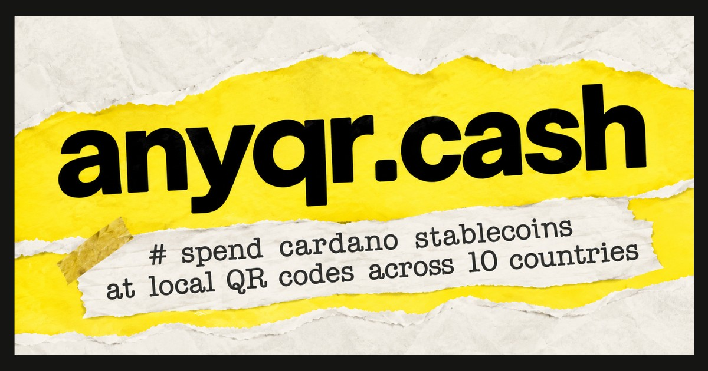

<p align="center">
  
</p>

<h1 align="center">anyqr</h1>

<p align="center">
  <b>Spend stablecoins at any local QR code.</b><br>
  <a href="https://anyqr.cash">anyqr.cash</a> · by SyncAI.network
</p>

<p align="center">
  
  
  
  
</p>

---

Turning stablecoins into local currency takes an exchange, a bank and a lot of
waiting. anyqr closes that gap in about 90 seconds, in a completely
decentralised manner.

anyqr deletes the middle. Scan the shop's QR. Type the amount in rupees, reais,
rupiah, whatever the country uses. Sign once. A merchant on the other side pays
that shop from their own bank account in seconds, and the contract hands them
your stablecoin plus a 2 percent spread the moment you confirm the cash landed.

No custodian ever holds your funds. No company can freeze the order. An Aiken
validator on Cardano holds the escrow from the first signature to the last, and
the payout fires on its own with no claim button and no support ticket. Three
signatures, about 90 seconds, ten countries.

**Fully decentralised. Non custodial. Your keys, your funds.**

On mainnet it gets faster still: every order fans out to both the Cardano native
book and p2p.foundation's global merchant network, $31.4M settled across
341,200+ orders, so it fills wherever a merchant answers first.

## What is in this repo

```
qrpay/
  escrow/          Aiken v1.1.23 escrow validator (Plutus V3) + property tests
  sdk/             TypeScript SDK on Lucid Evolution, prepare + execute split
  app/             Next.js 16 web app (buyer wallet, merchant desk, scanner)
  scripts/         one shot scripts for wallet gen, minting, e2e lifecycle test
```

## The escrow

Each order is its own UTXO at a single Aiken validator address. Datum encodes
the order state, redeemer selects the action. Lifecycle:

```
Placed  ->  Accepted  ->  Paid  ->  (auto)  complete  ->  tUSDM to merchant
```

Any party can `raiseDispute` while the order is Accepted or Paid, which freezes
the escrow until an admin resolves it. Users can `cancelUnaccepted` or `refund`
if the flow stalls.

Every state transition is covered by property tests including deadlines,
signatures and the value preserving invariant on continuing outputs.

## The trust model

Buyer locks tUSDM into escrow on Cardano. Merchant sends fiat off chain from
their bank app. Buyer confirms receipt, which starts a short dispute window.
After the window closes without dispute, the escrow releases the tUSDM to the
merchant automatically.

Reputation lives on the merchant identity (planned CIP-0170 DID). Merchants
who complete honest trades build reputation and route more volume. Merchants
who steal a trade lose their entire reputation and future routing weight.

## Liquidity routing

Today every order fills on the Cardano native order book in this repo. Merchants
register here, watch the desk, and take orders one at a time.

On mainnet an order is published to two books at once:

```
                    +--> Cardano native book   (merchants running this app)
   order placed ----+
                    +--> p2p.foundation        (existing global merchant network)
```

Whichever side accepts first takes the order and the other listing drops. The
buyer never picks a route and never waits on one merchant being awake, which is
what gets resolution time down.

The second route is worth wiring in rather than growing a merchant base from
zero because p2p.foundation is already at scale:

```
$31.4M     total volume processed since inception
341,200+   orders settled
$4.69M     July 2026 volume, up 31 percent month over month
```

Those are p2p.foundation's numbers, not anyqr's. anyqr brings the Cardano side:
USDCx and USDM liquidity, the escrow validator in this repo, and buyers holding
stablecoin on Cardano who currently have no way to spend it at a local QR.

## Running locally

Requires Node 20+, pnpm 9+, and the Aiken toolchain
(`curl -sSfL https://install.aiken-lang.org | bash && aikup install v1.1.23`).

```
pnpm install
```

Set the following in a `.env` at the repo root:

```
BLOCKFROST_PROJECT_ID=preprod...
NEXT_PUBLIC_BLOCKFROST_PROJECT_ID=preprod...
TUSDC_POLICY_ID=<your test stablecoin policy>
TUSDC_ASSET_NAME=<hex asset name>
NEXT_PUBLIC_TUSDC_POLICY_ID=<same as above>
NEXT_PUBLIC_TUSDC_ASSET_NAME=<same as above>
```

Then

```
cd escrow && aiken build           # compiles plutus.json
cd sdk && pnpm build               # compiles the SDK
cd app && pnpm dev                 # http://localhost:3000
```

## End to end test on Preprod

Once the Aiken validator is built and the SDK is compiled, an end to end
lifecycle test on Cardano Preprod runs from `scripts/e2e.mjs`. It places an
order, accepts it with the merchant seed, marks it paid, waits for the
dispute window, and completes it. Every transaction produces a cardanoscan
link.

```
cd scripts && node e2e.mjs
```

## The web app

`app/` is a Next.js 16 app using CIP-30 wallet connect. Buyer signs
placeOrder and markPaid with their own wallet. Merchant signs
acceptOrder and complete with theirs. A wallet is bound to a single role
(user or merchant) after first connect.

Routes:

```
/           landing with role picker
/start      country picker
/home       buyer dashboard, balance, recent orders
/scan       camera QR scanner + manual URI paste
/pay        review, sign, live status
/merchant   merchant desk (pre login onboarding, post login orders)
```

## The SDK

`@qrpay/sdk` is a TypeScript SDK built on Lucid Evolution. Every write
action has a matched `prepare` returning an unsigned tx builder and
`execute` that signs and submits. All returns are neverthrow `Result`
types. Zod validation at every boundary.

```ts
import { placeOrder, createClient } from "@qrpay/sdk";

const client = createClient({ lucid, validator, usdc, adminPkh });
const r = await placeOrder(client).execute({
  orderId, usdcAmount, fiatAmount, fiatCurrency: "INR", ...
});
```

## Status

Prototype on Cardano Preprod. Full lifecycle proven on chain end to end.
Not on mainnet yet. Dual routing to p2p.foundation ships with the mainnet
release, alongside the Cardano native book.

## License

MIT
